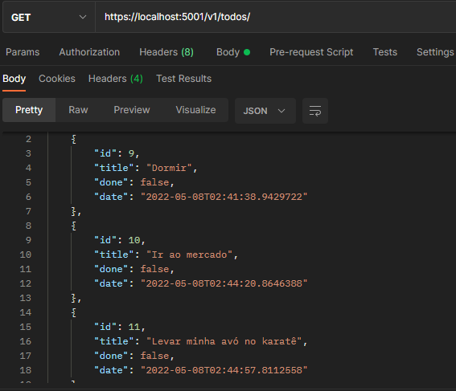
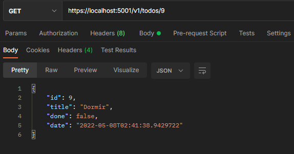
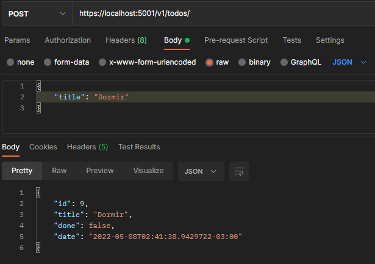
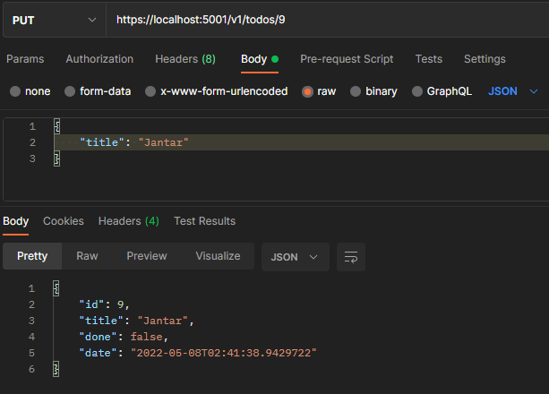

<h1 align="center"> Todo List Api </h1>

## Setup do projeto
- C# (_.NET v5_)
- SQLite
- Entity Framework

## Instale as dependências
```
dotnet add package Microsoft.EntityFrameworkCore.Sqlite
```
```
dotnet add package Microsoft.EntityFrameworkCore.Design
```

### Para criar o banco de dados utilize:
```
dotnet ef migrations add InitialCreation
```
```
dotnet ef update database
```
### Rode o projeto com:
``` 
dotnet watch run
```

## Endpoints

### Listar todos as tarefas
Para listar todas as tarefas, acesse o endpoint abaixo: 
<br>

**GET /v1/todos**



### Listar tarefa específica
Para mostrar apenas uma tarefa específica, basta acessar:
<br>

**GET /v1/todos/{id}**



### Criar tarefas
Para criar uma tarefa, acesse: <br>

**POST /v1/todos**
``` Json
{
	"title": "Dormir"
}
```


### Atualizar título de uma tarefa
Caso você precise trocar o título de sua tarefa, acesse:
<br>

**PUT /v1/todos/{id}**
``` Json
{
	"title": "Jantar"
}
```


### Remover tarefas
Se desejar remover uma tarefa, acesse: 
<br>

**DELETE /v1/todos/{id}**